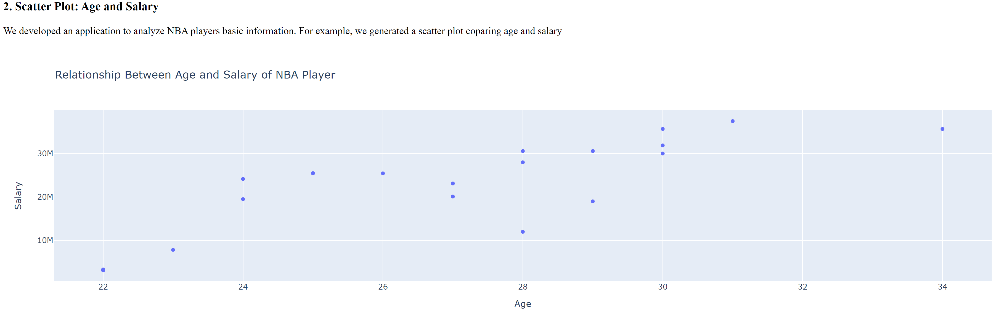
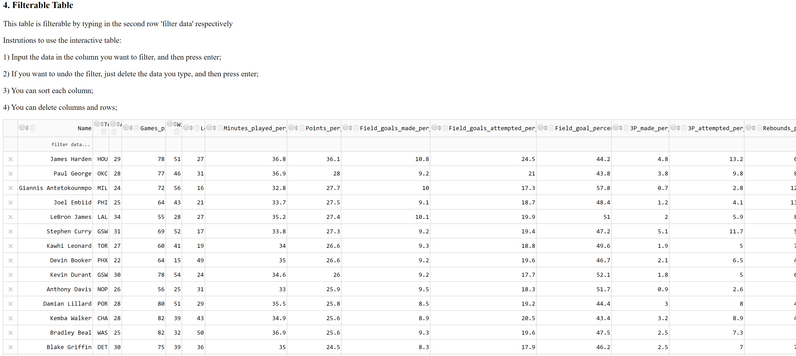
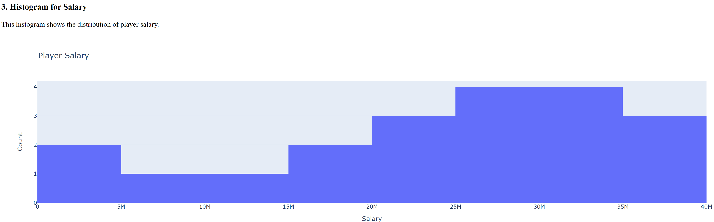
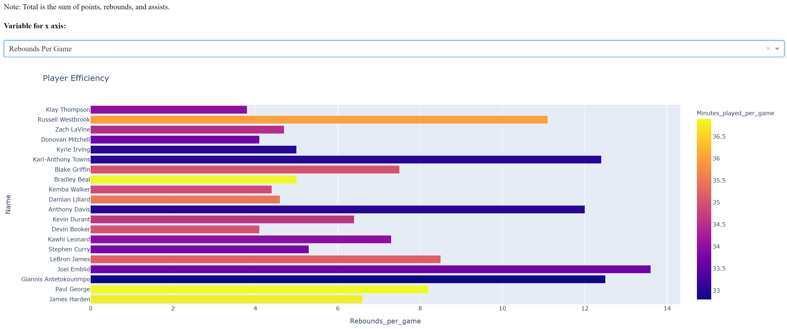
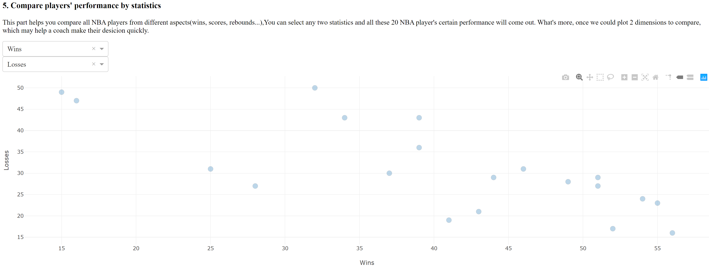

# Analysis-of-NBA-Players-Performance
An interactive dashboard using Python Dash and Plotly

This is a reactive dashboard report for analyzing player efficiency, created by my team. There are five graphs analyzing players salary, age, performance, etc. User can input or select based on different analyzing demands to investigate responding information.

Nowadays, the NBA has become more and more popular around the world, what followed is the salary of NBA stars rising up rapidly. The NBA restricts team spending on salaries unsing a salary cap, meaning all teams in this league use nearly the same amount of money to build a team which could win the final championship. Based on the context, how to spend money sensibly and reasonably is the most important thing in every team managers' and coaches' mind.

To fix the problem we mentioned above, our group decided to help team managers and coaches to analyze the NBA players' performance and their salaries from 5 aspects: player efficiency, Scatter Plot: Age and Salary, Histogram for Salary, Filterable Table, and Compare players' performance by statistics. Usingour graphs and plots, we could decide which player is the most efficient and who's the most cost-effective star for the given season.

Below are some screen shots of the Dashboard

